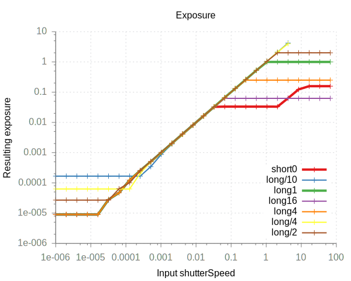
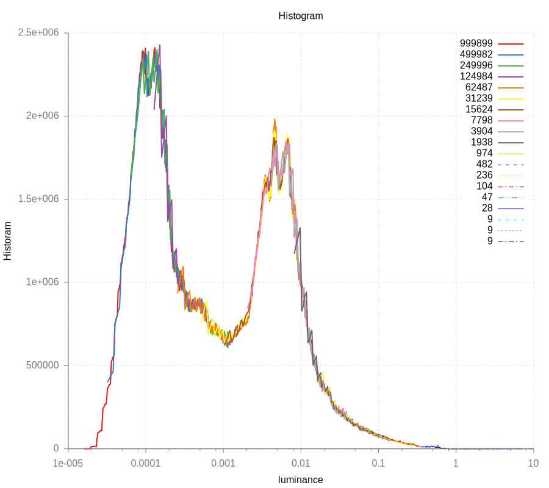

raspberrypi-openmax-exposure-series
===================================

Welcome to the raspberrypi-openmax-exposure-series project page.

The goal was to capture a time series with a Raspberry Pi camera using C/C++ to have the input images which can be combined to a HDR image.

I found OpenMAX is the way to go on the Raspberry Pi. Thanks to <https://github.com/gagle/raspberrypi-openmax-jpeg> I had an OpenMAX environment which was able to capture jpeg images.

# Pushing the exposure time to the extremes

The Camera Module v2 is using the Sony IMX219 sensor and is capable of capturing up to 10 s exposures according to <https://media.readthedocs.org/pdf/picamera/latest/picamera.pdf>. The highest exposure I was able to obtain is 4.2 s.

Unfortunately the exposure time is depending on the current frame rate. Setting a lower frame rate allows for a longer exposure. On the other end&#x2014;the shortest exposure I got was 9 µs. See Figure below for the exposure times obtained using various framerates.

# RAW Format

The RAW format is 10 bit linear encoded having values [0,1024). Black is not 0 but 64. There are two more tricky points:

1.  Very dark and very light pixles do not have a high signal to noise ratio, therefore, I filtered out values below 15 and above 300.
2.  I found the exposure time reported is off by 16 &micro;s.

Taking these points into account the histograms of the different exposures align pretty well, see Figure below.

# openmax-jpeg

#### An OpenMAX IL example that captures a JPEG image with a Raspberry Pi ####

The Multi-Media Abstraction Layer (MMAL) library provided by Broadcom is not documented, so it's nearly impossible to understand how to use it. Furthermore, it's a library that wraps all the OpenMAX IL specification, so if you simply need to capture a JPEG image like in this example, you can just ignore that extra layer and talk directly to OpenMAX IL. Once you understand OpenMAX IL, it's affordable to try to write your own programs without MMAL. In other words, if you are new to the OpenMAX world, it's better to learn OpenMAX IL than MMAL, which is not documented and only works with Broadcom devices.

This example captures an image in a JPEG format. The components involved are: `camera` and `image_encode`. The `image_write` component doesn't work correctly or I don't understand how to use it. I always get the error `OMX_ErrorInsufficientResources` when I change the `image_write` state from LOADED to IDLE.

Build steps:

- Download and install the `gcc` and `make` programs.
- Download this repository.
- Compile and execute: `make && ./jpeg`

Useful documentation:

- [OpenMAX IL Specification v1.1.2](https://www.khronos.org/registry/omxil/specs/OpenMAX_IL_1_1_2_Specification.pdf)
- [Understanding OpenMAX IL](http://www.slideshare.net/pchethan/understanding-open-max-il-18376762)
- [Broadcom OpenMAX IL components](https://github.com/raspberrypi/firmware/tree/master/documentation/ilcomponents)
- [OpenMAX IL header files](https://github.com/raspberrypi/firmware/tree/master/opt/vc/include/IL)
